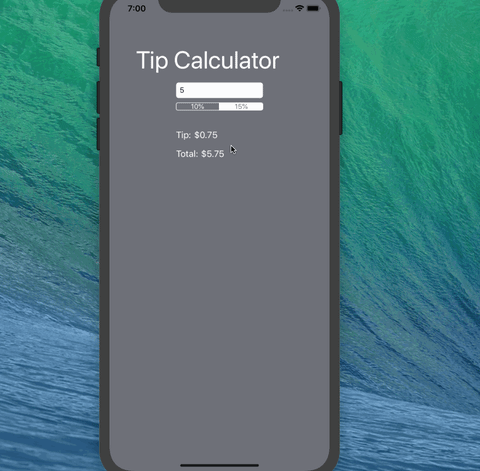

# Pre-work - *Tip Calculator*

**Tip Calculator* is a tip calculator application for iOS.

Submitted by: Giovanny Cerna

Time spent: **15** hours spent in total with trying to set up VM on windows

## User Stories

The following **required** functionality is complete:

* [ X] User can enter a bill amount, choose a tip percentage, and see the tip and total values.

The following **optional** features are implemented:
* [ ] Settings page to change the default tip percentage.
* [ ] UI animations
* [ ] Remembering the bill amount across app restarts 
* [ ] Using locale-specific currency and currency thousands separators.
* [ ] Making sure the keyboard is always visible and the bill amount is always the first responder. This way the user doesn't have to tap anywhere to use this app. Just launch the app and start typing.

The following **additional** features are implemented:

- [ ] List anything else that you can get done to improve the app functionality!

-[x]Party size option to divide tip between multiple people and give amount per person

## Video Walkthrough

Here's a walkthrough of implemented user stories:

https://media.giphy.com/media/Sr8AZZ6jpTq1quIJaX/giphy.gif
GIF created with [LiceCap](http://www.cockos.com/licecap/).

## Notes

## License

Copyright [2019] [Giovanny Cerna]

Licensed under the Apache License, Version 2.0 (the "License");
you may not use this file except in compliance with the License.
You may obtain a copy of the License at

http://www.apache.org/licenses/LICENSE-2.0

Unless required by applicable law or agreed to in writing, software
distributed under the License is distributed on an "AS IS" BASIS,
WITHOUT WARRANTIES OR CONDITIONS OF ANY KIND, either express or implied.
See the License for the specific language governing permissions and
limitations under the License.
